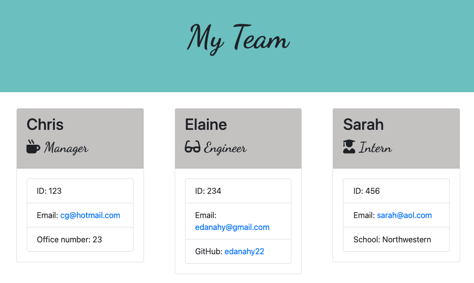

# Team Profile Generator

## Description
Team Profile Generator is a Node.js command-line application that takes in information about employees on a software engineering team and generates an HTML webpage displaying information and necessary links about each team member.

## Table of Contents

* [Installation](#Installation)

* [Usage](#Usage)

* [Development](#Development)

* [Testing](#Testing)

* [Questions](#Questions)

## Installation
To run this application, the user must have node.js installed on their device and a system for running command-line applications, such as terminal.

To run this application, [Inquirer package](https://www.npmjs.com/package/inquirer) and [jest](https://www.npmjs.com/package/jest) need to be installed.

## Usage
In the command-line, the user inputs "node index.js" to run the application.

The user is prompted with questions to fill out information about their team. First, they are prompted to provide the role of the team member (enigneer, manager, intern). Then they are prompted to enter the member's name, email, and id number. The last question prompted is role dependent (engineer: github username, manager: office number, intern: school). Once all the prompts are entered, the user can enter another team member or choose no new members to add to their team. 

After they have finished entering their team, and html page is generated displaying the team and all of the prompted information. 

[Walk-through Video](https://drive.google.com/file/d/1zRndeY9fq4LA-wgkeefp5ysBYEs9FE5N/view)

## Development
This application was developed using html, css, javaScript, node, Inquirer, and jest packages. There was a focus on using Object Oriented Programing for this application with the use of constructor objects and classes.

Bootstrap, Google Fonts, Font Awesome, and custom CSS were used for styling. 

## Testing
Tests for this application were ran via jest in the command line. Test can be run via "npm run test" in the command line.

## Questions
If you have any questions or note any issues with this application please contact me at:

[Github](https://www.github.com/edanahy22)

[Email](mailto:elainedanahy2022@u.northwestern.edu)

